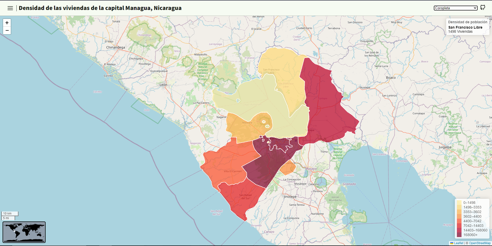

 
    <h1>Pagina web del Mapa de Managua, capital de Nicaragua</h1>

   
  <a href="./README.es.md">Spanish</a> | <a href="./README.md">English</a>
   

 

## Técnicas cartográfica:
- `Coropleta`
- `Símbolos proporcionales`

## Librería:
- [leafflet](https://leafletjs.com/)

### Plugins:
- [leaflet.WorldMiniMap](https://github.com/maneoverland/leaflet.WorldMiniMap)  

## Uso
`src/scripts/config.js`: En el objeto `config` Podrás definir La información general de la pagina web, junto con las capas del Mapa

## 🎮 Demostración
[Aquí](https://osmarmora05.github.io/choropleth-proportionalSymbols-leaflet-GIS/)

## 🛠️ Pila de tecnologías
- HTML
- CSS
- JavaScript
- Git
- Penpot

### Iconos
- [tabler](https://tabler.io/icons)

## Autor
- Osmar Adrian Mora Cerna [@osmarmora05](https://github.com/osmarmora05)
