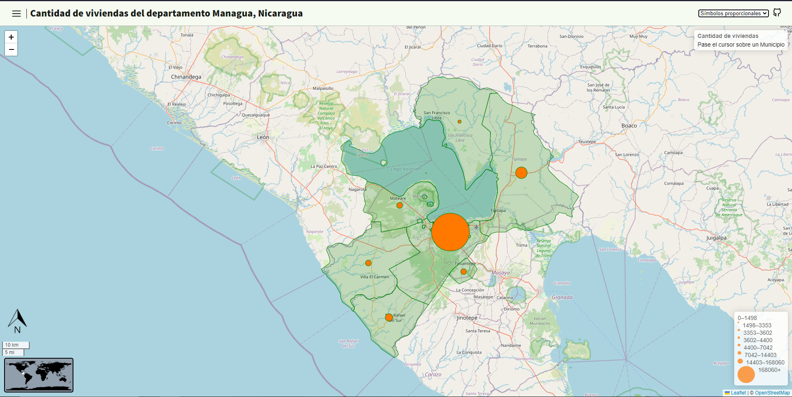

 
    <h1>Pagina web Mapa, Cantidad de viviendas del departamento Managua, Nicaragua</h1>

   
  <a href="./README.es.md">Spanish</a> | <a href="./README.md">English</a>
   

 
Coropleta

Símbolos proporcionales

## 🗺️ Técnicas cartográfica
- Coropleta
- Símbolos proporcionales

## 📓 Librería
- [leafflet](https://leafletjs.com/)

### Plugins
- [leaflet.WorldMiniMap](https://github.com/maneoverland/leaflet.WorldMiniMap)  

## ⚙️ Uso
`src/scripts/config.js`: En el objeto `config` Podrás definir La información general de la pagina web, junto con las capas del Mapa

## 🎮 Demostración
[Aquí](https://osmarmora05.github.io/choropleth-proportionalSymbols-leaflet-GIS/)

## 🛠️ Pila de tecnologías
- HTML
- CSS
- JavaScript
- Git
- Penpot

### Iconos
- [tabler](https://tabler.io/icons)

## ©️ Autor
- Osmar Adrian Mora Cerna [@osmarmora05](https://github.com/osmarmora05)
