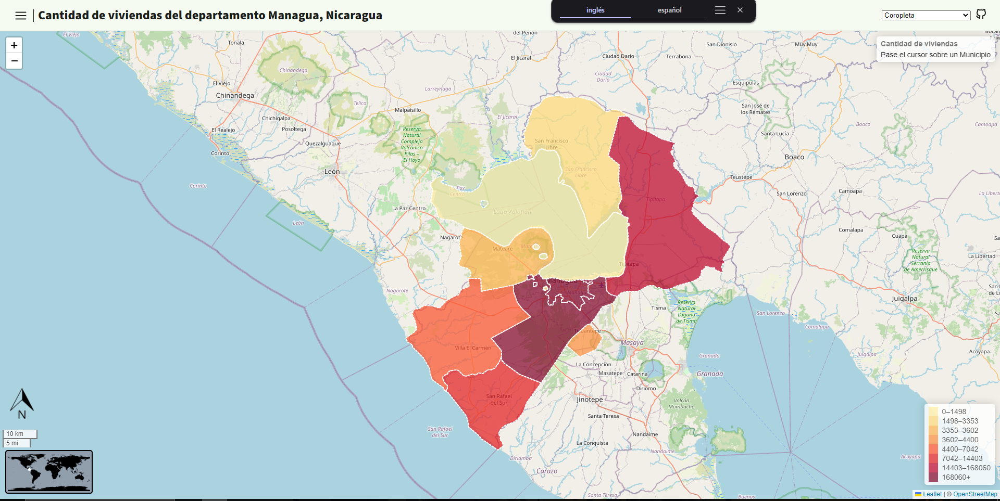

 
    <h1>Website of the Managua Map, Capital of Nicaragua</h1>

   
  <a href="./README.es.md">Spanish</a> | <a href="./README.md">English</a>
   

 

## Cartographic Techniques:
- `Choropleth`
- `Proportional Symbols`

## Library:
- [Leaflet](https://leafletjs.com/)

### Plugins:
- [leaflet.WorldMiniMap](https://github.com/maneoverland/leaflet.WorldMiniMap)  

## Usage
`src/scripts/config.js`: In the `config` object, you can define the general information of the website along with the Map layers.

## 🎮 Demo
[Here](https://osmarmora05.github.io/choropleth-proportionalSymbols-leaflet-GIS/)

## 🛠️ Tech Stack
- HTML
- CSS
- JavaScript
- Git
- Penpot

### Icons
- [tabler](https://tabler.io/icons)

## Author
- Osmar Adrian Mora Cerna [@osmarmora05](https://github.com/osmarmora05)